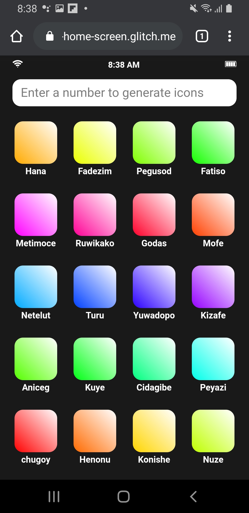
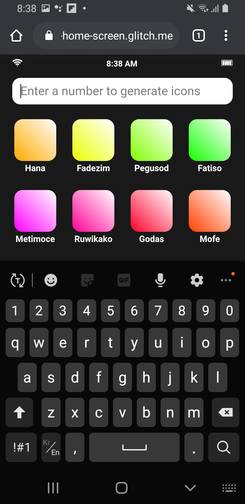
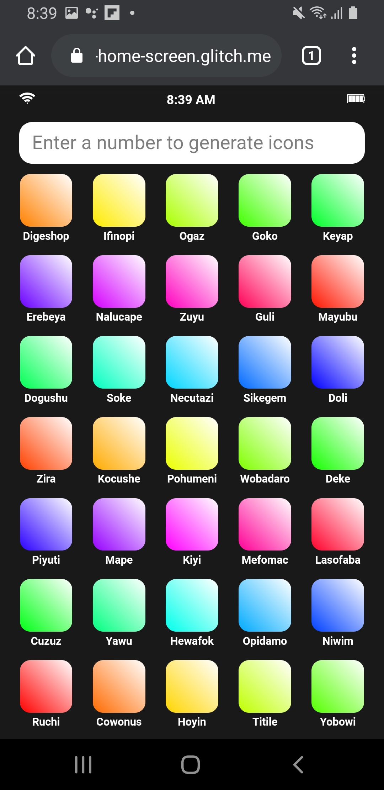
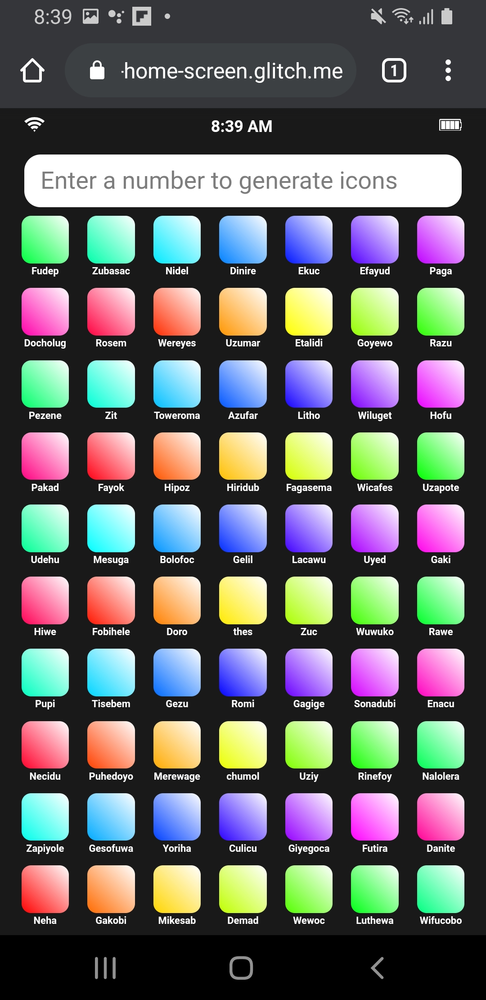

# Home Screen



## Description

This repo is the week3 assignment of the "Hand Held: Creative Tools for Phones" course at ITP.  
The assignment is to create a mockup of an imaginary home screen for mobile phones using HTML and CSS.  
My goal was to create a home screen that fits all icons in one page regardless of how many apps are installed.

Here's the [Live Demo on Glitch](https://cuinjune-home-screen.glitch.me/).

### The Problem

According to statistics, there are between 60 and 90 apps installed on the average smartphone. 
But how many apps do we actually use? I would easily assume that most people use less than 20 apps in everyday life.
Because there are so many apps installed on their phone, their home screen is divided into multiple pages of apps.

While having pages is useful, it has two problems:
1. It requires more interactions (swipe) from users to find and open an app.
2. Users don't feel the need to clean unused apps which makes the first problem worse.

### The Solution

My solution to this problem is to fit all icons in one page regardless of how many apps are installed.
As the number of apps grow, the size of icons will become smaller and smaller. And as they get smaller, it will make it more difficult for the user to open an app.
This gives them good motivation to clean unused apps that will improve their experience and make more available storage on their phone. 
And since the user can see all apps in one page, it requires single (touch) interaction to open an app.


### How to use

Visit the [app link](https://cuinjune-home-screen.glitch.me/) in your phone's browser, or use the following QR code to visit the link:


If you open the app, it will look something like this:


The icons are being added from bottom to top order so the most frequent used apps can always stay at the bottom.  
And the app names are randomly generated whenever the icons are generated.   

You can use the text field at the top to type and submit a number of app icons to generate.  



For example, the following is the result you will get if you submit "35":



And this is the result of "70" app icons:



Icons are kind of too small and it will motivate the user to clean unused apps.

### Future Works

In the future, I would like to add the magnification effect (similar to the one used for the Dock icons on macOS) to enlarge icons on touch dragging so the user can more accurately interact with small icons. 

## Setup

1. You need to have [Python[(https://realpython.com/installing-python/) installed on your computer
2. Run the following commands in the Terminal
```
git clone https://github.com/cuinjune/home-screen.git
cd home-screen
python -m http.server 8080
```
3. Open your web browser and navigate to http://localhost:8080

## Author
* [Zack Lee](https://www.cuinjune.com/about): an MPS Candidate at [NYU ITP](https://itp.nyu.edu).
